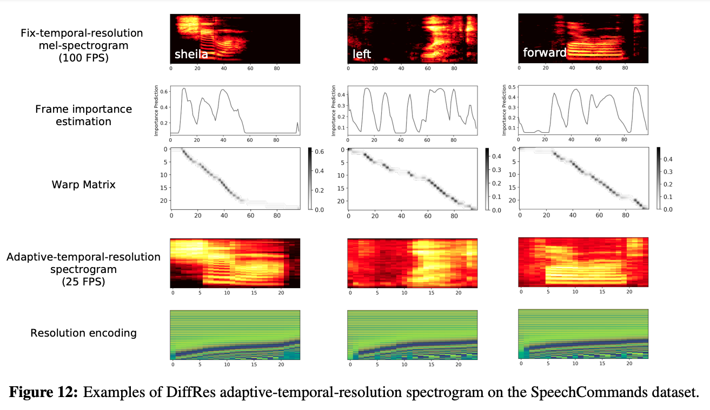
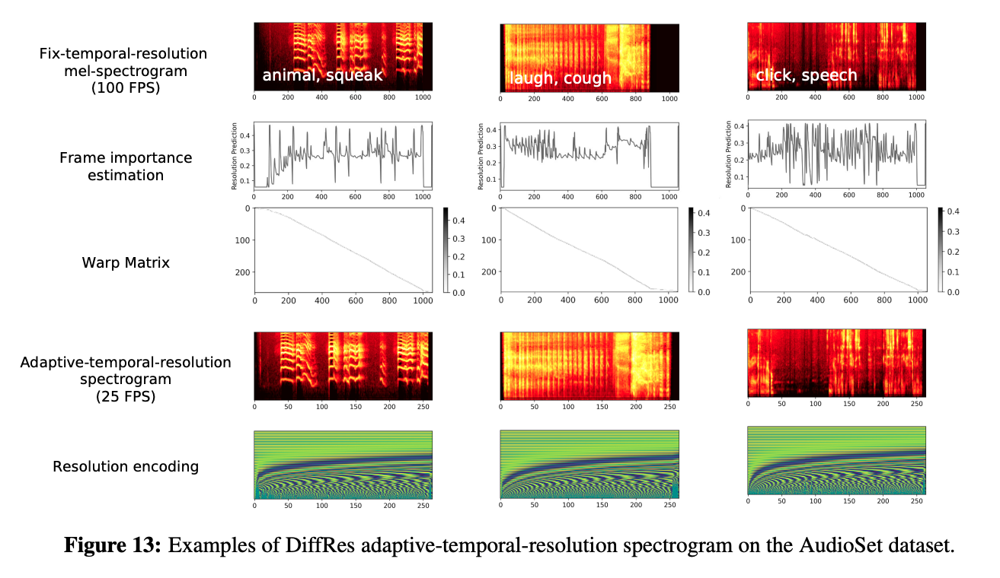

# Learning differetiable temporal resolution

This work introduces DiffRes, which enables differentiable temporal resolution learning on audio spectrogram (as opposed to common fixed hop size approaches) to improve the performance of audio classification models. 


DiffRes-based method can achieve the same or better classification accuracy with 25%-75% fewer temporal dimensions on the feature level.

This algo **could also be useful** for the compression of other time-series data, by merging non-essential time frame and preserve important frame.

DiffRes: 
1. Enables differentiable temporal resolution learning to improve the performance of audio classification models. 
2. Merges non-essential time frames while preserving important frames. 
3. Acts as a "drop-in" module between an audio spectrogram and a classifier, and can be end-to-end optimized.

Fun fact:
1. Working on spectrogram with a tiny hop size / very-high temporal resolution (e.g., 1 ms) becomes computationally tractable, by selectively compressing the time dimension using DiffRes.
2. The dynamic time compression of DiffRes act as data augmentation.


# Usage

Very simple, just insert DiffRes between the spectrogram and your down stream task!

First, install this algorithm:
```shell
# Install pydiffres via pip
pip install pydiffres
# Install torch-scatter via conda
conda install pytorch-scatter -c pyg
```

Then try out this example:

```python
import os
import torch
from pydiffres import DiffRes

# =========> Assume you have already got a spectrogram (better in log-scale)
# The spectrogram data: [Batchsize, T-steps, F-bins]
data = torch.randn(1, 3000, 128)  

model = DiffRes(
    in_t_dim=3000, # The temporal dimension of your spectrogram
    in_f_dim=128, # The frequency dimension of your spectrogram
    dimension_reduction_rate=0.75, # How much temporal dimension to remove
    learn_pos_emb=False # If you like to make the resolution encoding learnable
)


# Use DiffRes to compress the temporal dimension
# fix-resolution/hopsize Spectrogram ===========> compressed spectrogram
ret = model(data)

# 1. Add this to your loss function: ret["guide_loss"].
# 2. Use this for classification: ret["feature"].
# 3. Alternatively, you can also use ret["avgpool"] or ret["maxpool] classification with/without ret["resolution_enc"] for classification.

```

The ret variable is a python dict, which has the following keys:

- "score": 
  - The importance score of each spectrogram frame.
- "guide_loss": 
  - A loss value that you need to optimize so that DiffRes can work.
- "avgpool": 
  - The compressed feature using avgpool aggregation.
- "maxpool": 
  - The compressed feature using maxpool aggregation.
- "resolution_enc":
  -  The resolution encoding.
- "feature": 
  - The concatenation of ret["avgpool"], ret["maxpool], and ret["resolution_enc"]
- "activeness": 
  - A value indicates the activeness of DiffRes. Higher value means DiffRes is distinguishing important frame actively.
- "x": 
  - The original input spectrogram.

You can directly using ret["feature"] for classification. Or you can DIY your own version using ret["avgpool"], ret["maxpool], and ret["resolution_enc"].

You can visualize the DiffRes output dict by
```python
# Visualization of DiffRes. 
model.visualize(ret, savepath=module)
```

## The classification pipline

Coming soon

## Cite as

Coming soon


## Examples



